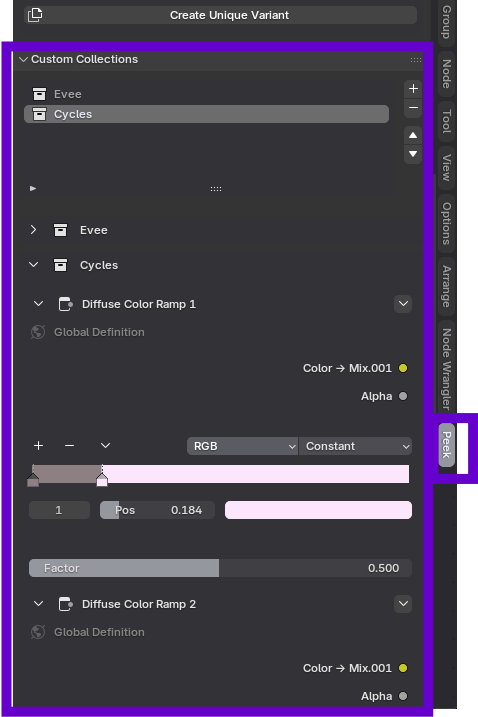

# Custom Collections

When you have added a Node Group to the Peek Hierarchy (see [Hierarchy & Operations](hierarchy-operations.md)), you can curate exactly which parameters are exposed in the sidebar using **Custom Collections**.

## Creating a Custom Collection

Inside the node group you are peeking:

1.  **Right-click** on a node you want to expose.
2.  Select: `Context Menu -> Peek Options -> New Collection`.
3.  Enter a collection name (Default is "My Controls").

The node will appear in the **Custom Collections** sub-panel of the sidebar. This allows you to build a clean, custom interface for complex node groups without exposing every single node.
