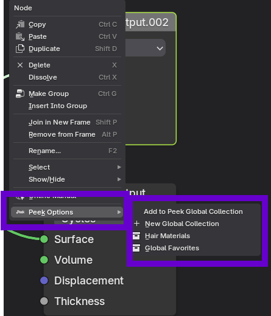

# Global Collections

**Global Collections** are the easiest way of using Peek. These are node collections that can be seen globally from the Peek sidebar panel.

## Adding a Node to Global Collections

Right-click on any node in the shader editor that you want to add to the sidebar and select:

`Context Menu -> Peek Options -> New Global Collection`

*(If collections already exist, you will see them listed or can create a new one)*

Enter the name of the collection when prompted, and the node will appear in the **Global Collections** sub-panel.

## Managing Collections

You can add, delete, and reorder the node collections using the up/down arrows next to the Global Collections List.

> [!WARNING] Nodes in a global collection are bound to the specific material to which they belong.
>
> If you later add the parent node group to the **Peek Hierarchy** (Advanced Mode), nodes in Global Collections from that group will be **pruned** to prioritize the hierarchy view.
