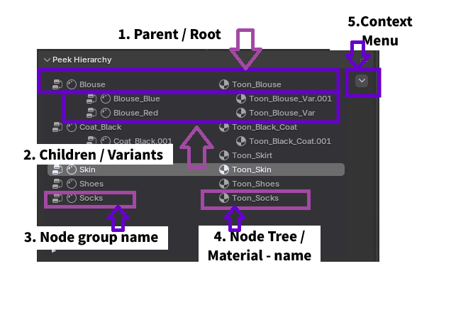
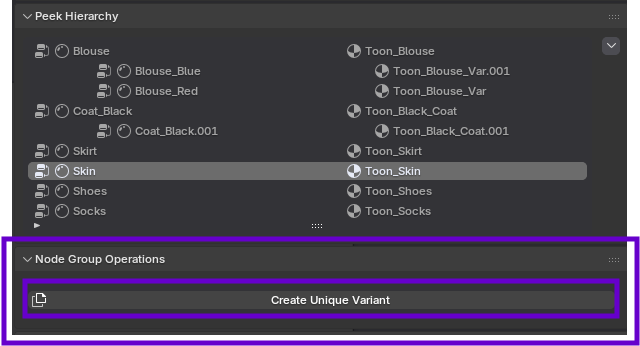
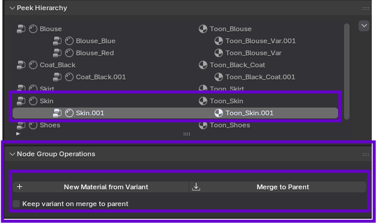

# Hierarchy & Operations

The core power of Peek a Node comes from its **Hierarchy** system, allowing you to manage node groups and materials contextually.

## Peek a Node Group

To start, right-click on any node group and select:
`Peek Options -> Peek Node Group`

This adds the node group to the **Peek Hierarchy**.

## The Peek Hierarchy

The hierarchy shows the relationship between your node groups and the materials they belong to.

### Hierarchy Context Menu
Clicking the dropdown arrow next to a hierarchy item reveals the following management operations:

*   **Apply Material to Selected Object**: Instantly applies the current material—including all active Peek configurations and variants—to any other objects currently selected in the 3D Viewport. This ensures consistent material assignment across your scene.
*   **Remove node group from file**: Permanently deletes the node group data from the Blender project file. **Caution**: This is a destructive action that will remove the node group from all materials that reference it.
*   **Remove from peek view**: Stops tracking this node group in the Peek sidebar. The node group and its data remain in your project and material, but it will no longer clutter your Peek Hierarchy interface.

---

## Node Group Operations

Peek distinguishes between a **Root Material** (the original) and **Variants**.

### Root Material
When a node group is first added to the hierarchy, it is designated as the **Root Material**. This represents the master version of your material.

To create a variation without altering the original, select **Create Unique Variant**. This creates a new material instance that branches off from the root, allowing for safe experimentation.

### Unique Variants
A **Unique Variant** appears as a child of the Root Material in the hierarchy. This structure allows you to manage multiple iterations of a material on the same object or across different objects.

#### Merging Variants
Once you are satisfied with a variant, you can commit its changes back to the Root Material or manage its persistence using the **Merge** operations.

**Merge to Parent**:
Overwrites the Root Material's settings with those of the currently selected variant. This effectively promotes the variant to become the new standard for the Root Material.

*Option: Keep Variant on Merge*
This toggle controls the post-merge behavior of the variant itself:

*   **If Disabled** (Default): The variant is deleted after its settings are merged into the Root. The object reverts to using the updated Root Material.
    

*   **If Enabled**: The variant is preserved as a separate, independent, and unlinked material on the object, even after its settings have been merged into the parent Root.
    
