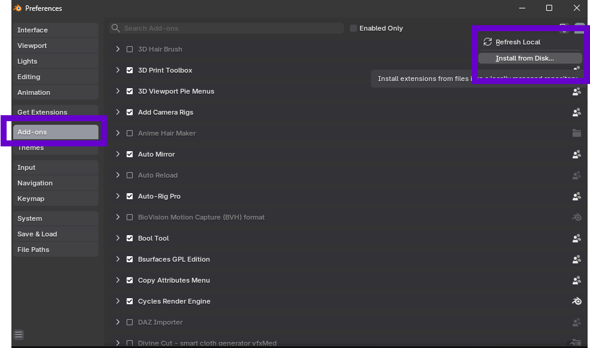
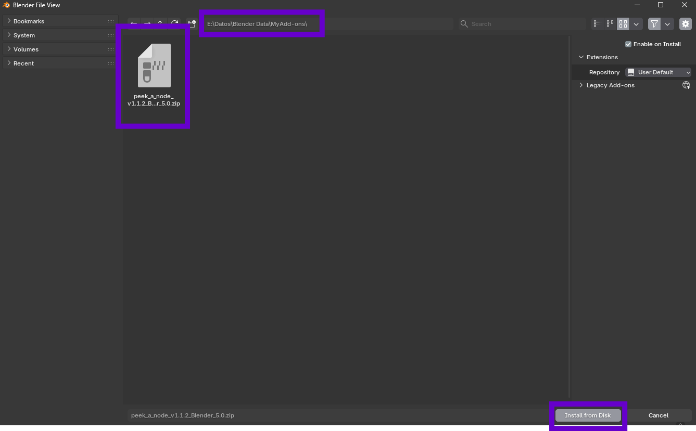

# Installation

Getting started with Peek a Node is simple. Follow these steps to install the add-on in Blender.

**Note**: Install v1.1.1 for Blender 4.3 up to 4.5. Install v1.1.2 for Blender 5.0 and above.

1.  **Open Preferences**: Navigate to `Edit` > `Preferences` > `Add-ons`.
2.  **Install from Disk**: Click the **Install...** button (or "Install from Disk..." from the dropdown).

3.  **Locate File**: Navigate to where you downloaded the `.zip` file for the add-on. Select it and click **Install Add-on**.

4.  **Enable**: Enable the add-on by checking the box next to its name.

You are now ready to use Peek a Node!
